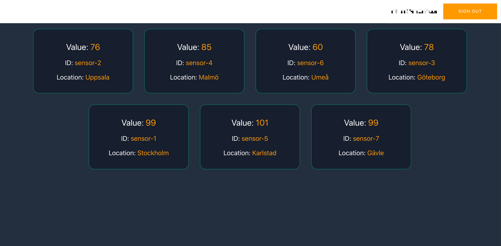
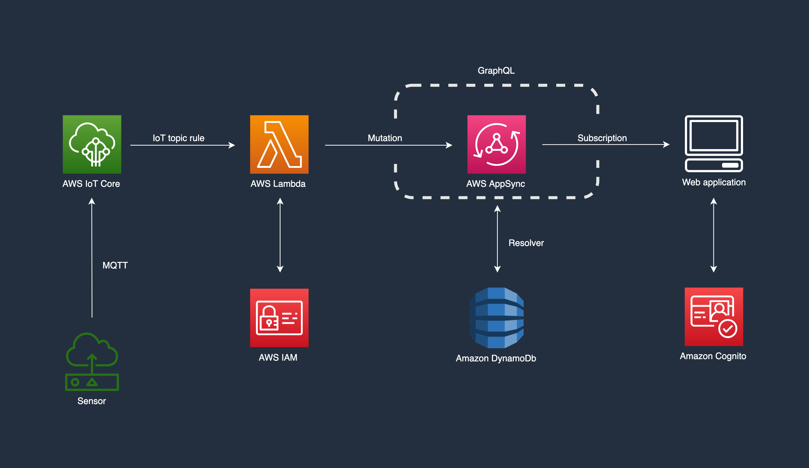

# IoT sensor real-time dashboard

This repo contains the code for both the frontend and the backend of a real-time IoT sensor system.



## Architecture



## Installation

### Pre-requisites

- [Valid AWS credentials](https://aws.amazon.com/premiumsupport/knowledge-center/create-and-activate-aws-account/)
- [AWS SAM installed](https://docs.aws.amazon.com/serverless-application-model/latest/developerguide/serverless-sam-cli-install.html)
- [npm installed](https://nodejs.org/en/download/)

### Installation guide

Deploy CloudFormation template in the folder `backend` using AWS SAM. Save arguments to .toml file

```bash
sam build && sam deploy --guided
```

The cloudformation template takes two parameters:

- `APIName` - a prefix for all provisioned resources. For instance `IotSensor`
- `IotTopic` - the IoT topic for which an IoT topic rule is created, routing all messages to a lambda. On the form `my/topic`, or `aws/device/+/sensor`. See [the docs](https://docs.aws.amazon.com/iot/latest/developerguide/topics.html) for more information on how to construct your MQTT topics.

When deploy fails, enter `capabilities = "CAPABILITY_NAMED_IAM"` instead of `capabilities = "CAPABILITY_IAM"` in the `backend/samconfig.toml`, and run

```bash
sam deploy
```

This is because some of the policies and roles created are given explicit names, to make them more easily searchable. The AWS SAM cli command `sam deploy --guided` doesn't give you the option to use "CAPABILITY_NAMED_IAM" out of the box, which is why this step is necassary.

Once that has been deployed successfully, create `frontend/src/aws-exports.js`, based on the template in `frontend/src/aws-exports-template.js` and populate with the values obtained deploying the CloudFormation template above. These are reported back to you in the shell where you deployed the template as an output, or discoverable on the cloudformation page in the AWS console, under the output tab for you specific stack.

In the `frontend` folder, run

```bash
npm install && npm start
```

to install all npm modules and start a local dev server.

localhost:3000 is opened, and you're prompted to sign in / create a user.

### Testing

To test live updates of the dashboard,
[will add script to generate data] use the AWS IoT core testing interface, and publish messages to the topic specified when deploying the CloudFormation template. The topic can found in the `backend/samconfig.toml` file. Publish a message with the following payload:

```json
{
  "SensorId": "sensor-1",
  "sensorLocation": "Stockholm",
  "sensorValue": "99"
}
```

### Clean up

To delete the provisioned AWS resources, run

```bash
aws cloudformation delete-stack --stack-name <stack-name>
```

where `<stack-name>` is the name of the cloudformation stack, specified when deploying the template. Can be found in `backend/samconfig.toml`
